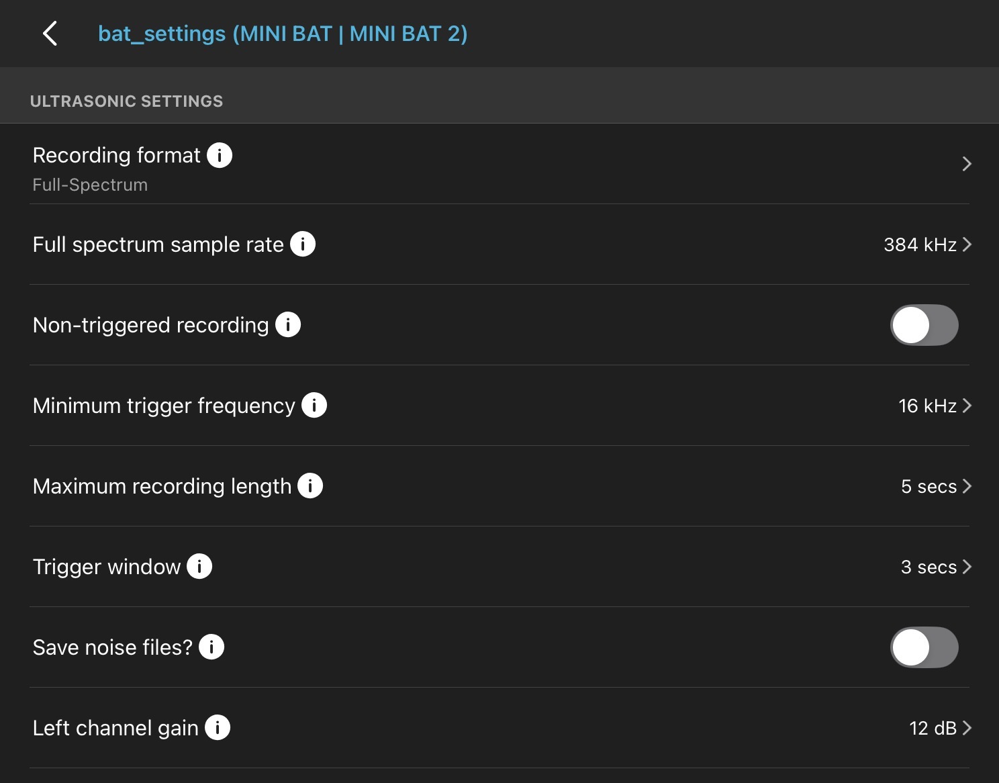
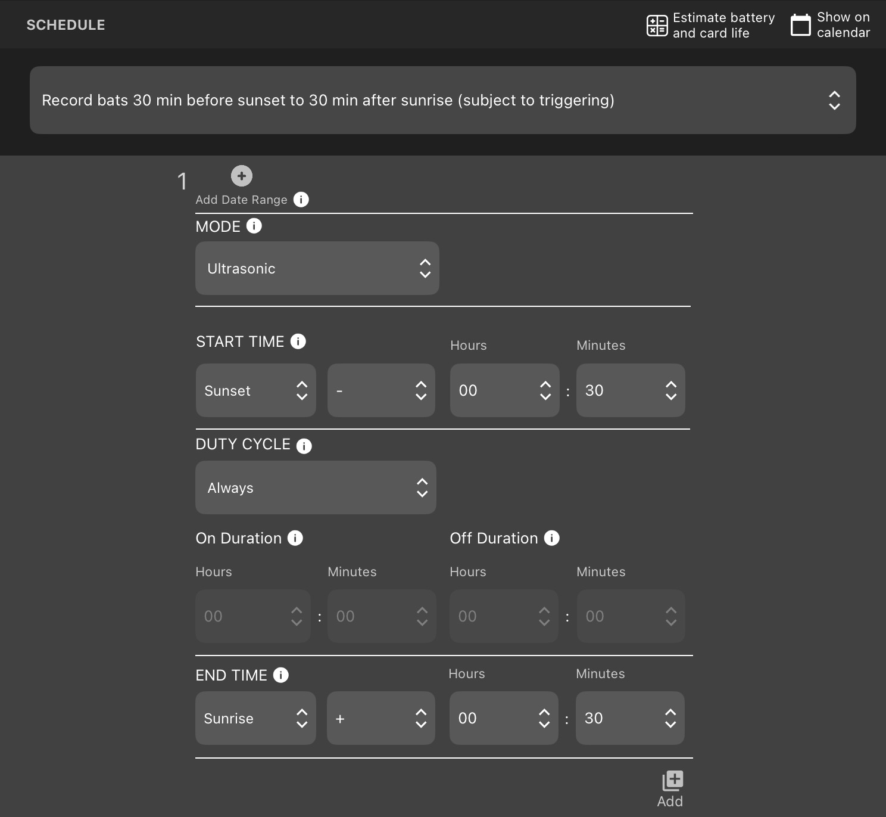
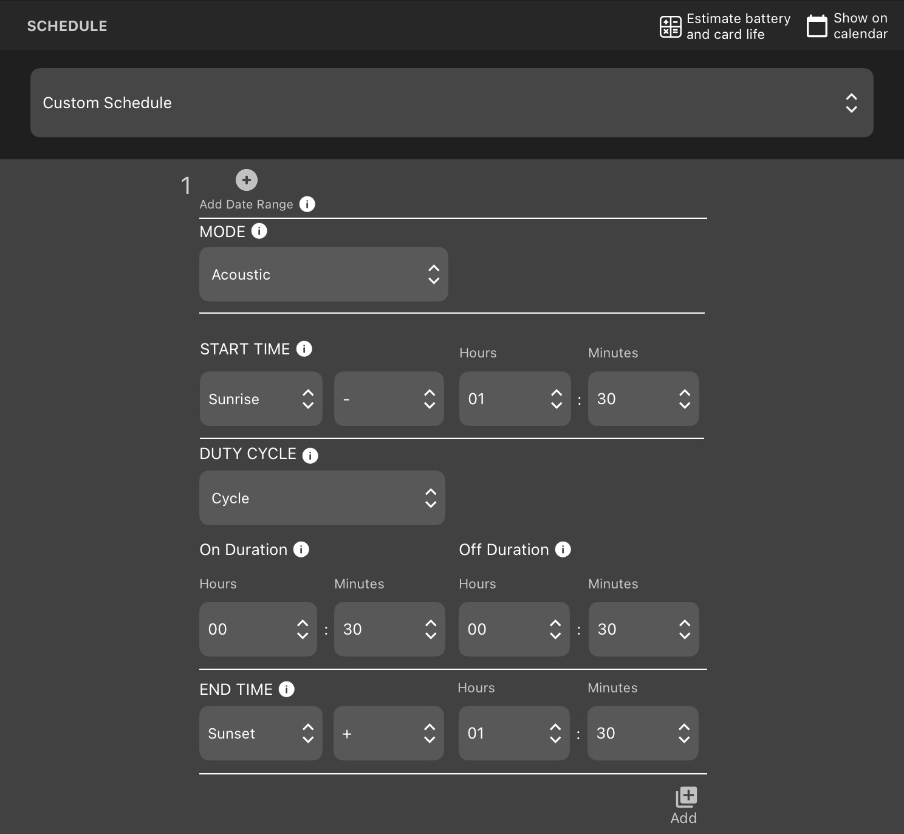

# Song Meter Mini Bat Pairing & Configuration Settings

## Pairing 
1.  Open Song Meter Configuration app and turn on device
    - MiniBat device needs to have charged batteries
2. Device name will pop up on app under "Recorders"
3. Hold down PAIR button on device
4. Select Pair on the app to the right of the device name
5. Press Configure on app to edit device settings

## Bat Settings

For bat recording, the acoustic microphone attachment is not required.

**Ultrasonic Settings**

- Recording format: Full Spectrum

- Full spectrum sample rate: Keep the 384 kHz default option. 
    - The other options are 256 kHz and 500 kHz, both of which aren't sufficient / necessary for SJNF NABat monitoring. 
- Non-triggered recording: keep this turned OFF so that the device only records when it has been triggered.
    - If this is turned on, the device will be continuously recording without a trigger, taking up unnecessary space.
- Minimum trigger frequency: 16 kHz is the recommended level for filtering out background noise.
    - Anything below the minimum trigger frequency will not trigger recordings. Generally speaking, NABats trigger at a higher frequency than 16 kHz. Therefore, we can eliminate recording extra background noise with a 16 kHz minimum trigger frequency.
- Maximum recording length: 5 seconds
    - A new file will be created if a bat is still present after 5 seconds.
- Trigger window: 3 seconds
    - Recorder stops saving data after a bat finishes its pass.
- Save noise files: Keep this turned off.
    - If this is turned on, background noise files won't be deleted, taking up unnecessary sapce.
- Left channel gain: 12 dB
    - Options are 0, 6 12 dB. We will stick with the default option 12 dB.

**Acoustic Settings**

These settings can only be adjusted when the acoustic microphone is attached, which will will not use for Bat monitoring. 

**Location & Time Zone**

Reset location the field when deploying. Colorado is in UTC-06:00 time zone.

**Delay Start**

A scheduled start date can be preprogrammed, but instead we will leave this field blank and configure at deployment.

**Send Bluetooth Beacons** 

Always keep this on.

**Schedule Editor:** Custom Schedule

Bat recordings need to start a minimum of 30 minutes before sunset and end a minimum of 30 minutes after sunrise. This schedule has the bat monitors on throughout the whole night, but only records when triggered. 

- Mode: Ultrasonic

- Start time: Sunset - 00:30

- Duty Cycle: Alwyas
    - Cycle is also an option, but since our recordings are triggered, we want to keep this always on. 

- End time: Sunrise + 00:30

## Bird Settings

For bird recordings, the acoustic microphone needs to be attached and plugged in.

**Ultrasonic Settings:** Leave default

**Acoustic Settings:** Leave default

**Location & Time Zone:** Reset location in the field when deploying. Colorado is in UTC-06:00 time zone.

**Delay Start:** Off

**Send Bluetooth Beacons**: On

**Schedule Editor:** Custom Schedule

Note that birds are most active in the morning, with activity typically starting right before first light. Starting recordings 1 hour and 30 minutes before sunrise provides the proper buffer. We still choose to record all day on a 30 minute cycle, as they are active throughout the day. 

- Mode: Acoustic
- Start time: 1 hour 30 minutes before sunrise
- Duty Cycle: Cycle
    - On Duration: 30 minutes. Off Duration: 30 minutes.
- End Time: 1 hour 30 minutes after sunset

**More information about configuration settings can be found on [Wildlife Acoustics Settings Reference Page](https://answers.wildlifeacoustics.com/r/en-US/Song-Meter-Mini-Bat-2-User-Guide/Settings-Reference).**

## Saving Configuration Settings

1. After finishing desired setting edits, click SAVE in top right corner and give it a name (ie. bat_settings)
2. To load these same settings onto another device, pair device and click LOAD button in top right corner of configuration settings page.
3. Select the name of the settings you want on the device. You will now have the same settings on multiple devices without having to reconfigure them individually.

## Clearing SD Card

1. To clear contents of SD Card, device needs to be paired and SD Card needs to be installed.
2. Open configuration settings.
3. Click utilities button in top right of configuration settings page.
4. Click Format SD Card and YES to erase all data. 
5. SD Card successfully formatted: OK

## Updating Firmware

Before deployment, it is important to make sure the firmware on your SD card is up to date. Information about firmware can be found on [Wildlife Acoustics Downloads Page](https://www.wildlifeacoustics.com/account/downloads). There are great video tutorials on how to load firmware on the [Wildlife Acoustics Video Tutorial Page](https://www.wildlifeacoustics.com/resources/video-tutorials/song-meter-mini-bat-2/en/song-meter-mini-bat-2-mini-bat-2-firmware).

1. Make sure SD Card is cleared, as described in the above section.
2. View and download the latest version of firmware onto your computer from the link above.
3. Insert the cleared SD card into your computer.
4. In file explorer, copy the latest firmware .smm download into your SD card.
5. Insert updated SD card into Song Meter device and turn it on.
6. Click the Function button on the device until Load LED button is solid green.
7. Press and hold the Function button until all LEDs are flashing. Once the lights go solid, the new firmware has been loaded.
8. You can check the status of your firmware by clicking Status on next to the device name on the app. Current firmware version is 5.2 for SM MiniBat. 

## Turning Off Device

1. On the recorders page of the app, click Unpair next to device name.
2. Turn off device.
