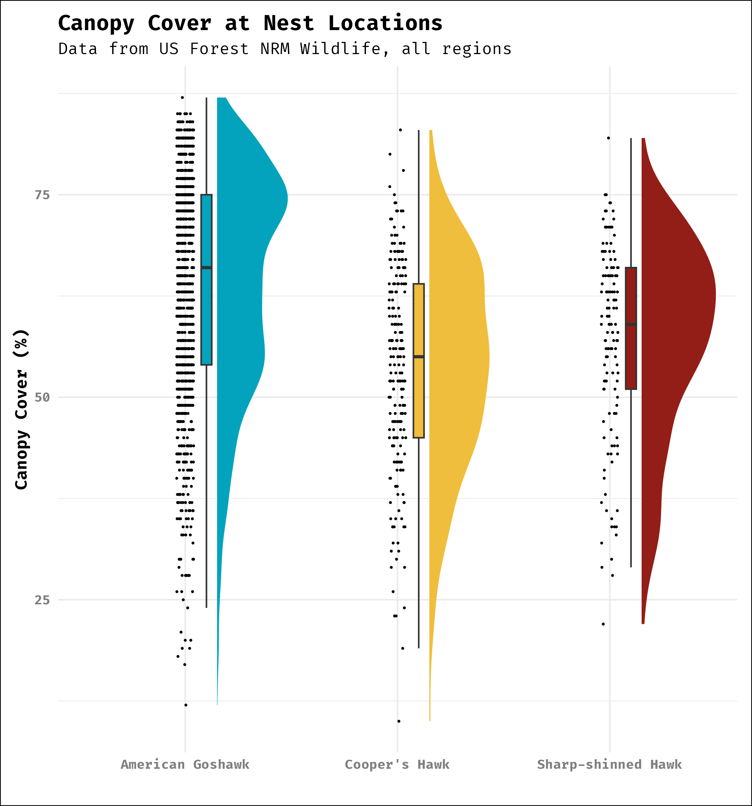
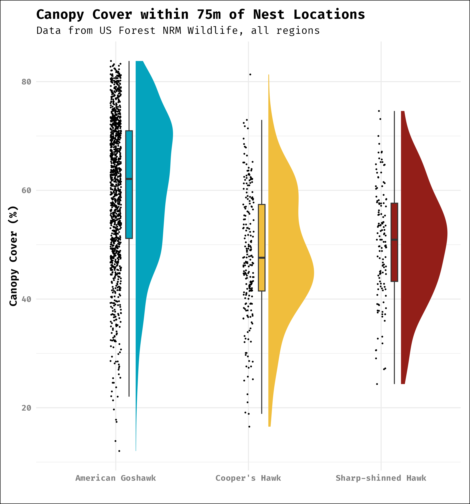
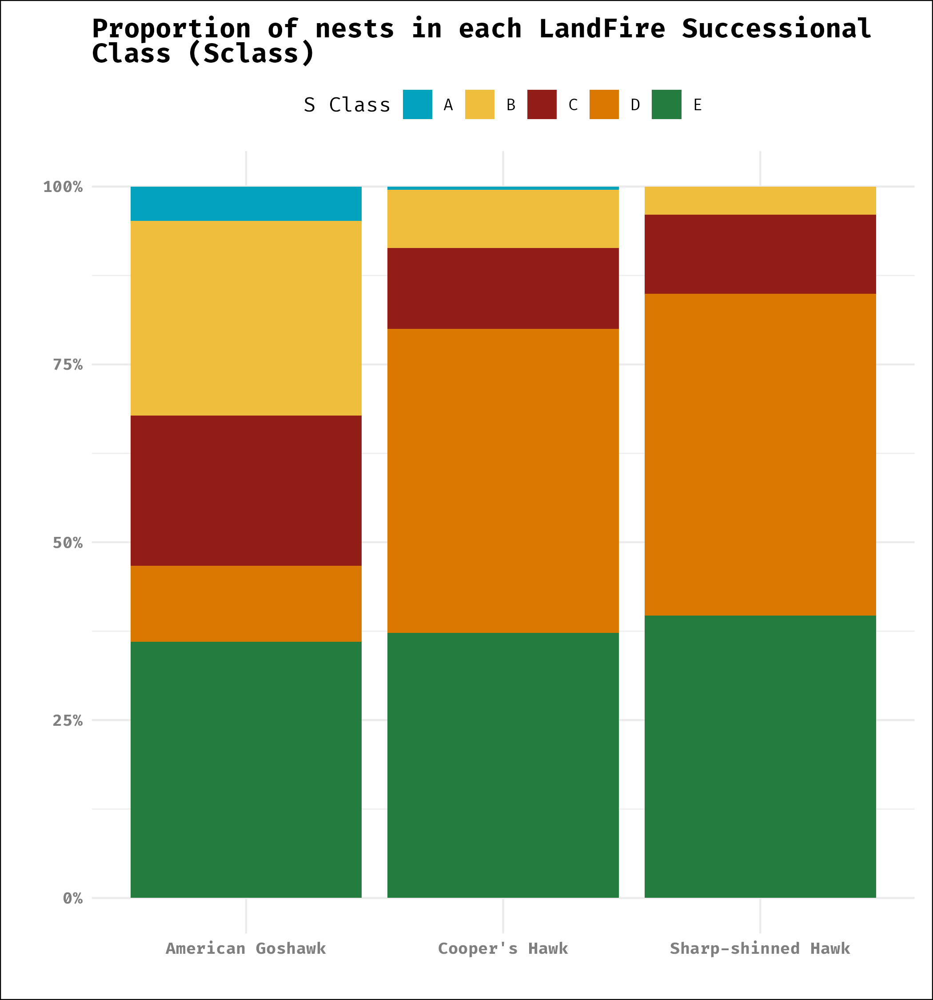
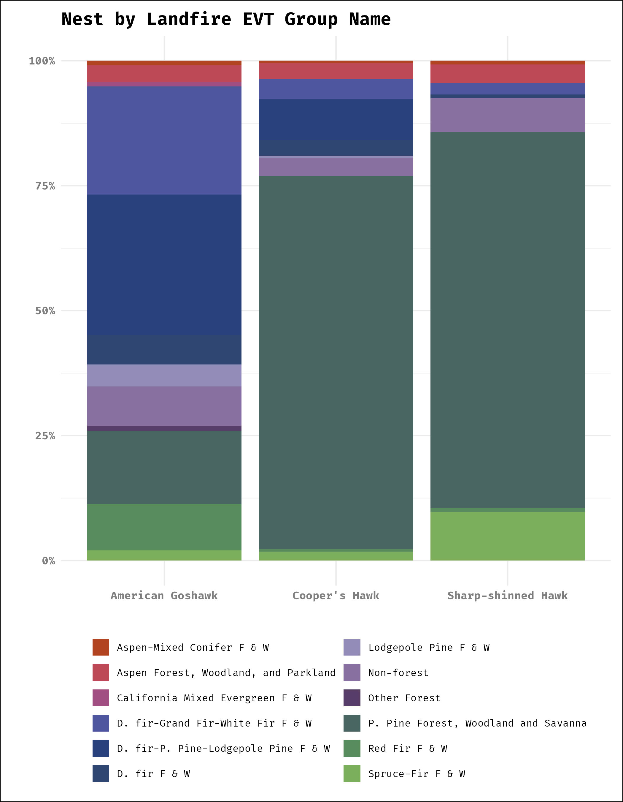
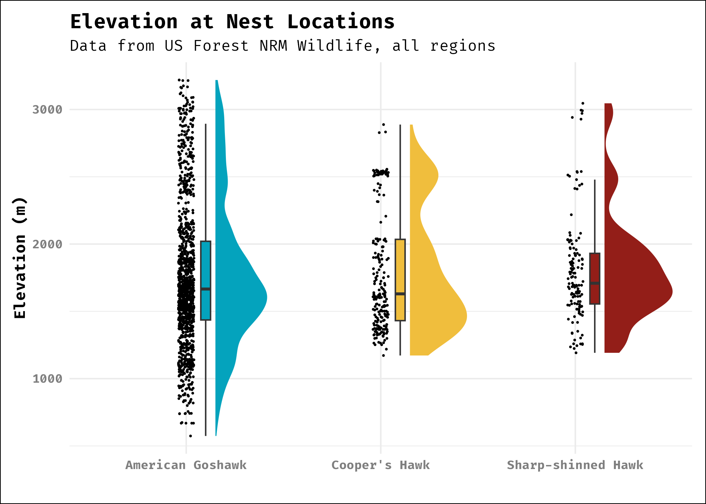
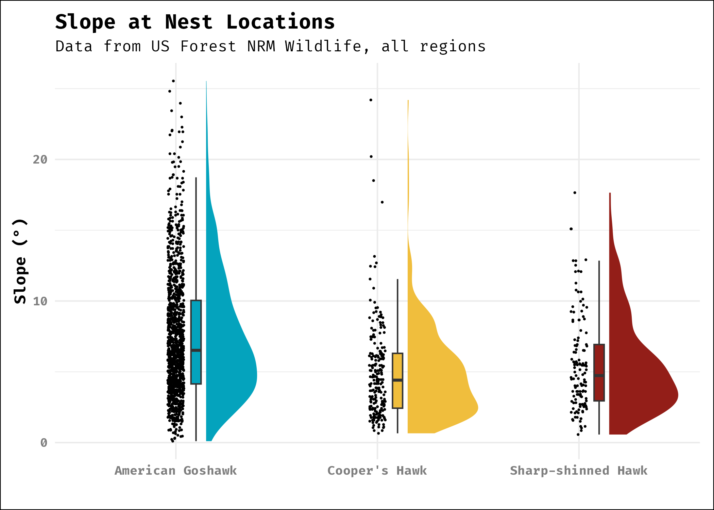
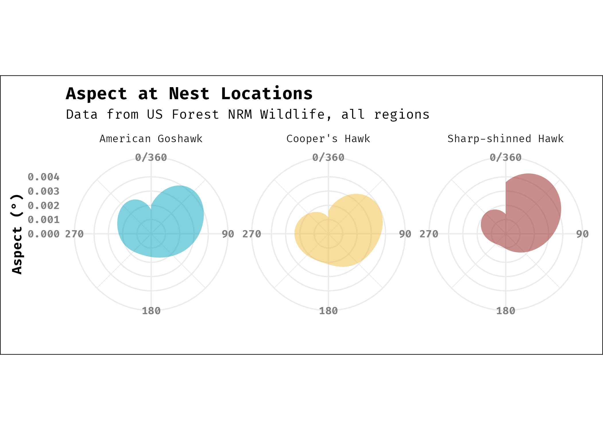
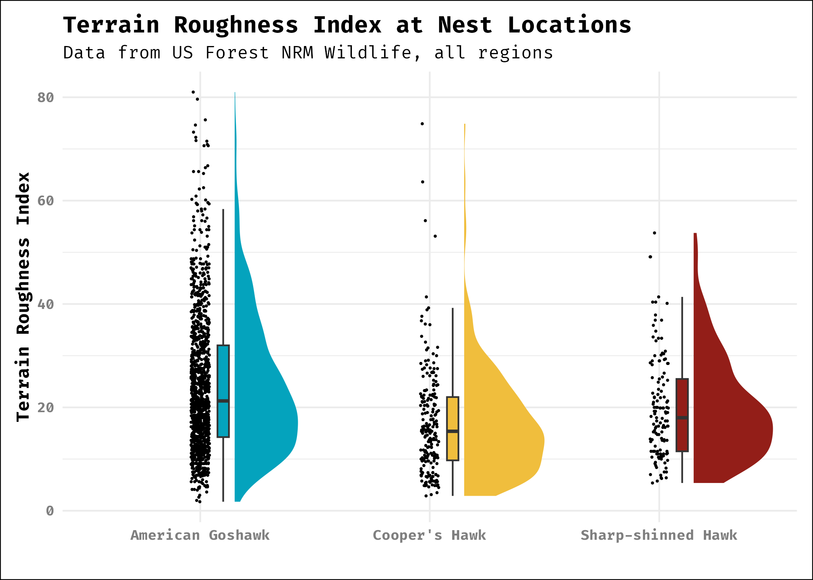
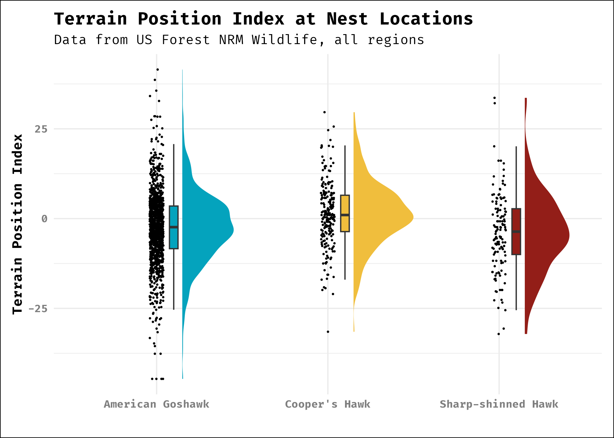

# Raptor Management for Timber Sales - Columbine RD
Mike Schmidt
2025-06-22

## Rules for Astur management on the Columbine Ranger District

**Disclaimer: Each of these is to be negotiated on a case by case basis
and should be agreed to prior to implementation. These are
recommendations until management, fuels, timber, fire and management
agree to them. -Mike**

**Survey Timing:** Nest surveys should occur within 3 years of
implementation or contracting. Once a contract is signed no future
surveys will be conducted unless a nest is discovered by the contractor
or if some other incidental observations occurs.

**Survey Requirements:**

-   Models have been developed for both Cooper’s hawk and goshawk. A
    model for Sharp-shinned hawk are under development. Projects that
    occur in low probability habitat may not need surveys after models
    have been evaluated for accuracy.
-   Surveys are required for all vegetation removal activities greater
    than 2 acres in size.
-   Surveys are required for all activities that will appreciably
    increase disturbance levels within a modeled nest stand for long
    periods of time. Activities that could increase nest stand
    disturbance are, for example: oil and gas production equipment and
    trails or roads. (Note: at the moment only American goshawk habitat
    is modeled on the San Juan National Forest.)

**Nest Site Protections:**

-   No cutting within 200m of a discovered nest, or no cut 30 acre
    buffer (Lambert 2021; Romin and Muck NA).  
-   No activity within 1/2 mile of the nest from March 15 to August 31
    (Lambert 2021; Romin and Muck NA).
-   No structural improvement within 1/2 mile (Lambert 2021).

Note: No activity buffers accomplish two goals: 1) they maintain nest
site characteristics and 2) give biologists some certainty that
alternate nest locations will get protections.

### Recommendations for improving raptor habitat

1.  Three 30 acres nest stands of old, dense trees should be left per
    5,500 acre area.  
2.  Three more stands of 30 acres should be developing in the 5,500 acre
    size.
3.  Increase number and size of openings. Openings should be
    approximately 2 to 4 ares in size and 2 to 3 should occur every 420
    acres.
4.  Manage fuels so that not all downed logs and snags are removed from
    each 420 acre plot.
5.  Generally decrease heterogeneity in timber treatments.

Old dense stands do not occur on the San Juan.

## Notes on Astur Species

### Goshawk

#### Notes

-   **Nest Site Size:** 20 to 25 acres
-   **Nest Site Fidelity:** Can return to the same nest stand
    intermittently for decades.
-   **Nest Site Density:** 30 trees/acre
-   **Nest Site Basal Area:** 110 to 140 sq. ft/acre
-   **Nest Site Canopy Cover:** Generally \> 60%
-   **Trends:**
    -   US:
        -   BBS: Flat/Down (-0.15 \[95% -0.91, 0.36\])
        -   eBird: NA
    -   Rocky Mountains:
        -   BCR (FS R2): Down (0: -3.67 \[95% -9.58, 1.28\], D: -3.13
            \[95% -8.71, 2.28\])
        -   BBS (Southern Rocky Mountains): Flat (0.27 \[-0.85, 1.6\])
    -   CO:
        -   BCR: Down (O: -4 \[95% -10.63, 2.98\], D: -3.96 \[95% -9.9,
            2.5\])
        -   BBS: Flat (0.14 \[95% -1.89, 2.22\])
    -   SJNF:
        -   BCR: Flat/Unknown (O: -2.42 \[95% -13.31, 12.89\], D: -0.6
            \[95% -11.98, 15.12\])

Flat in the US, flat to down in the Rockies, in Colorado down to flat,
and locally no evidence for trend.

### Cooper’s Hawk

#### Notes

-   **Nest Site Size:** 4-8 hectares (10-20 acres)
-   **Nest Site Fidelity:** Build nest in the same area each year, but
    can use the same nest each year. **Alternate nest sites are 170 to
    335m apart**.
-   **Nest Site Density:** 243–1,159/ha
-   **Nest Site Canopy Cover:** 64% to 95%
-   **Trends:**
    -   US
        -   eBird: Flat (-2% \[80% 7.9%, -9.5\])
        -   BBS: Up (1.53 \[95% 1.17, 1.88\])
    -   Rocky Mountains
        -   BCR (FS R2): Likely Increasing (D: 2.75 \[95% -0.61, 6.54\],
            O: 1.93 \[95% -0.88, 5.34\])
        -   BBS (Southern Rocky Mountains): Flat/Unknown (0.49 \[95%
            -0.88, 1.87\])
    -   CO:
        -   eBird: Down/Flat (-5.4% \[80% 6.2%, 11.5%\])
        -   BCR: Flat/Unknown (D: 1.49 \[95% -2.58, 5.12\], O: -0.02
            \[-95% 3.33, 3.37\])
        -   BBS: Up/Unkown (1.06 \[95% -0.87, 3\])
    -   SJNF:
        -   BCR: Flat/Unknown (D: 0.38 \[95% -7.93, 8.58\], O: -1.8
            \[95% -9.7, 6.87\])

In the US seems flat to up, in the rockies increasing to flat, in
Colorado relatively flat to slightly down, and on the SJNF flat.

### Sharp-shinned Hawk

#### Notes

-   **Nest Site Size:** NA
-   **Nest Site Fidelity:** Territories reused often but nests rarely
    reused.
-   **Nest Site Density:** NA
-   **Nest Site Canopy Cover:**NA
-   **Trends:**
    -   US:
        -   eBird: Down (-35.3% from 2012 to 2022 \[80% -23.3, -41.9\])
        -   BBS: Flat (0.06 \[95% -0.21, 0.35\])
    -   Rocky Mountains:
        -   BCR (FS R2): Increasing/Unknown (D: 1.79 \[95% -3.2, 7.23\],
            O: 1.37 \[-2.87, 6.14\])
        -   BBS (Southern Rocky Mountains): Flat/Unkonwn (-0.02 \[95%
            -1.35, 1.16\])
    -   CO:
        -   BCR: Flat/Unknown (D: 0.19 \[95% -4.72, 5.02\], O: -1.58
            (-1.58 \[95% -5.54, 3.08\]))
        -   BBS: Flat/Unknown (0.15 \[95% -1.42, 1.72\])
        -   eBird: Down (-21.3% \[80% -4.8, -40.3\])
    -   SJNF:
        -   BCR: Flat/Unknown (D: 0.65 \[95% -11.5, 12.84\], O: 0.87
            \[95% -8.63, 14.63\])

Nationwide, eBird seems to be fairly pessimistic about this species,
while BBS is flat. In the rockies sharp-shined hawks appear to be flat.
In Colorado, eBird has a negative trend. On the SJNF occupancy seems
flat, but probably very uncertain.

### Notes on Trend Sources

-   Breeding Bird Survey (BBS) Data uses the core trend analysis from
    1966 to 2022 (Ziolkowski Jr. et al. 2023).
-   Bird Conservancy of the Rockies Data (BCR) uses the trend analysis
    that vary in range depending on strata. Data are generally from 2008
    to 2024. (Rocky Mountain Avian Data Center 2.0. 2024)
-   eBird trends are from 2012 to 2022 (Fink et al. 2023).

## Nest Site Comparisons

There is a lot of overlap between the nest site canopy cover between the
three species. Generally, canopy coverage is highly variable at the nest
site. It looks like Goshawks prefer more dense stands than both Cooper’s
and sharp-shinned hawks. Reynolds et al. (1992) recommends 50 to 70% for
goshawks, but I think that these data show that goshawks will tolerate
lower canopy cover percentages (U. S. Geological Survey 2024).

Around the nest, there is more difference between the species. Goshawk
needs the most dense stands. Coopers and sharp-shinned need less stand
density. Goshawk numbers generally match Reynolds et al. (1992), but
here as well it appears that Goshawks will tolerate lower canopy cover
areas at their nest sites.

I’ve struggled a bit at what window size nest stand should be evaluated
at. The bigger the window the greater the likelihood that you will
average non-nest stand areas into the equation. The smaller the window
the less likely you are to characterize what a nest stand is. In this
case I used a window of 5 pixels, or two pixels on any side of the nest
pixel or about 75m from the nest. I think in the future I should
increase this because Goshawk nest stands are roughly 30 acres. Thirty
acre stands have a radius of approximately 200m (U. S. Geological Survey
2024).

Looking at the proportion of nests in each age class, we again see that
Goshawks are the great generalists. While they prefer later successional
classes, there are quite a few earlier successional classes (about 25%).
This is counter to Reynolds et al. (1992) who says that nest stands are
in late successional vegetation structural stages. Also interesting is
that both Cooper’s and sharp-shinned almost exclusively occur in late
successional stands (LANDFIRE 2023b).

What type of forest stands does each species occur in? Here it is
predominantly Ponderosa pine for both Cooper’s Hawk and sharp-shinned
hawk, while goshawk occurs in warm-dry mixed conifer forests and is
also, again much more of a generalist (LANDFIRE 2023a).

## References

Fink, D, T Auer, A Johnston, M Strimas-Mackey, S Ligocki, O Robinson, W
Hochachka, et al. 2023. “eBird Status and Trends.”
<https://doi.org/10.2173/ebirdst.2022>.

Lambert, Mark B. 2021. “Final San Juan National Forest Land and Resource
Management Plan.”

LANDFIRE. 2023a. “LANDFIRE: Existing Vegetation Type.”

———. 2023b. “LANDFIRE: SClass.”

Reynolds, Richard T, Russell T Graham, M Hildegard Reiser, Richard L
Bassett, Patricia L Kennedy, Douglas A Boyce, Greg Goodwin, Randall
Smith, and E Leon Fisher. 1992. “Management Recommendations for the
Northern Goshawk in the Southwestern United States.” U.S. Department of
Agriculture, Forest Service, Rocky Mountain Forest; Range Experiment
Station.

Rocky Mountain Avian Data Center 2.0. 2024. “RMADC 2.0: A Portal for
Avian Information from the IMBCR Program \[Web Application\].”

Romin, Prepared Laura A, and James A Muck. NA. “UTAH FIELD OFFICE
GUIDELINES FOR RAPTOR PROTECTION FROM HUMAN AND LAND USE DISTURBANCES.”

U. S. Geological Survey. 2024. “Annual NLCD Collection 1 Science
Products: U.s. Geological Survey Data Release.”
https://doi.org/<https://doi.org/10.5066/P94UXNTS>.

Ziolkowski Jr., David, Michael Lutmerding, Willow B. English, Veronica
I. Aponte, and Marie-Anne R. Hudson. 2023. “2023 Release - North
American Breeding Bird Survey Dataset (1966 - 2022).”
<https://doi.org/10.5066/P9GS9K64>.
